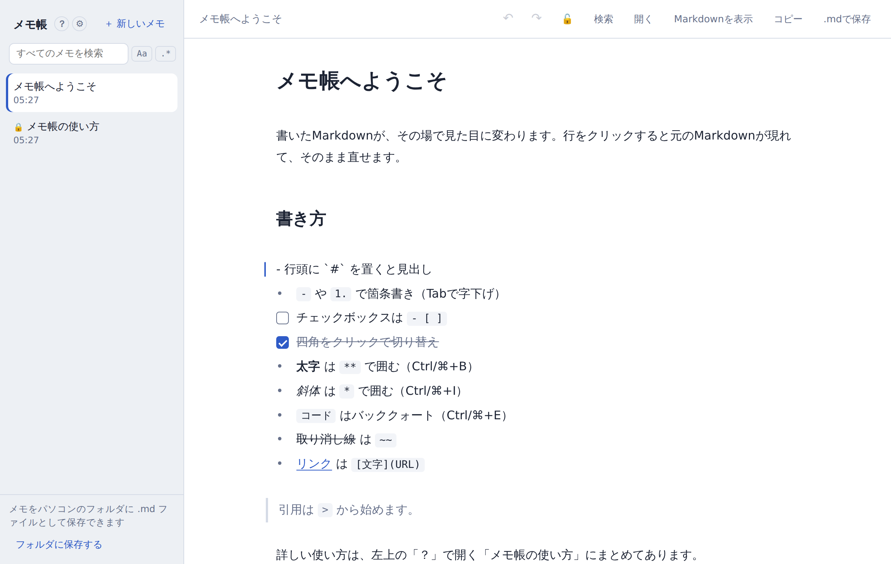

# Markdown メモ帳

HTMLファイル1つで動く、WYSIWYG風のMarkdownメモ帳です。書いたMarkdownがその場で整形表示に変わり、行をクリックすると元のMarkdownが現れてそのまま直せます。サーバーもインストールも不要で、メモはあなたのブラウザ、またはあなたが選んだフォルダにだけ保存されます。

## 使い方

- **すぐ使う**：<https://takaokawazoe.github.io/mdeditor/> を開くだけ。メモはその端末の中にだけ残ります
- **手元に置いて使う**：`index.html` をダウンロードしてダブルクリック（Chrome / Edge / Firefox / Safari）

詳しい操作は [docs/manual.md](docs/manual.md) に。同じ内容がアプリ内の「？」からも読めます。

## できること

- 見出し・箇条書き・番号付き・チェックボックス・表・コードブロック・引用・太字/斜体/コード/取り消し線/リンク
- 表は `| a | b` と打ってEnterするだけで区切り行が入り、編集を終えると縦線が自動で揃う
- メモ内の検索・置換（正規表現対応）と、全メモ横断の検索
- Shift+↑↓での行単位の選択（Ctrl/⌘+Aで全行）、Undo/Redo、メモのロック
- 一覧のドラッグ並べ替え（スマホは長押しして移動）、サイドバーの表示/非表示
- 上部バーの「ファイル」メニューにまとめた読み書き：.md/.txt や .zip の読み込み、フォルダ内の .md の一括読み込み、1件の .md 保存、全メモのフォルダ書き出し・.zip 保存（画面へのドラッグ＆ドロップでも読み込めます）
- フォントと文字サイズの設定、ショートカットキーの変更、ダークモード（OSの設定に追従）

## 保存先とプライバシー

- 既定ではブラウザ内（localStorage）に自動保存します。内容はどこにも送信されません
- Chrome / Edge（パソコン）では、フォルダを選んで各メモを `タイトル.md` として保存できます。他のエディタで編集したファイルも読み戻せます。両方で変わっていたら新しいほうを採用し、もう一方は「…の写し」として別のメモに残します
- サイドバー下にいまの保存先（ブラウザ／ローカルPCのフォルダ）が出ます。「保存先の切り替え」でいつでも変えられます
- 「ファイル」メニューから、全メモをフォルダや .zip にまとめて出し入れできます
- 外部への通信は Google Fonts からのフォント読み込みだけです（オフラインでは端末のフォントで表示されます）

## 対応環境

| 機能 | Chrome / Edge | Firefox / Safari | スマートフォン |
| --- | --- | --- | --- |
| 編集・検索・書き出し | ○ | ○ | ○ |
| フォルダ保存（File System Access API） | ○（パソコン） | × | × |
| 全メモを .zip で保存・復元 | ○ | ○ | ○（共有シート） |
| 全メモをフォルダへ一回きり書き出し／読み込み | ○（パソコン） | × | × |

## 構成

- `index.html` … アプリ本体（依存ライブラリなし）
- `docs/manual.md` … 操作マニュアル

## ライセンス

MIT License。詳細は [LICENSE](LICENSE) を参照してください。

## 開発

`tests/` に自動テスト（Playwright, Python）があります。`python3 tests/audit.py` で横断監査が走り、そのほかは機能ごとのテストです（一部は `python3 -m http.server 8123` を先に起動しておく必要があります）。
